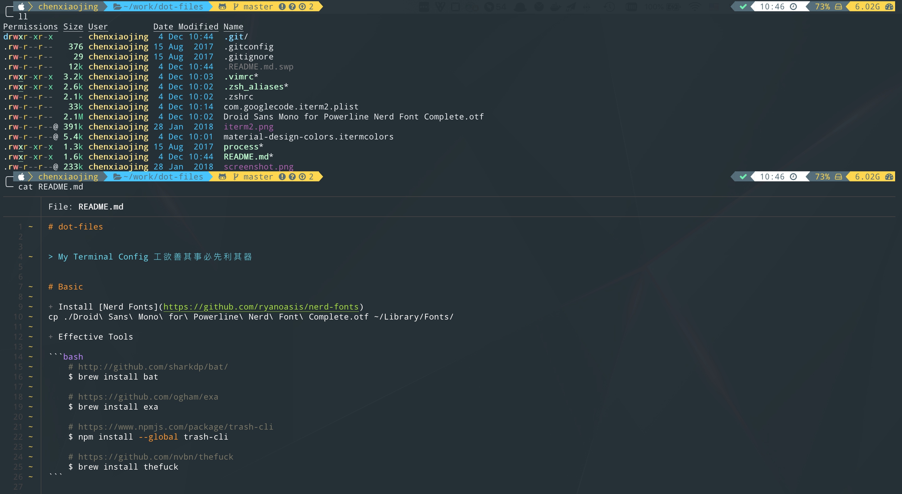
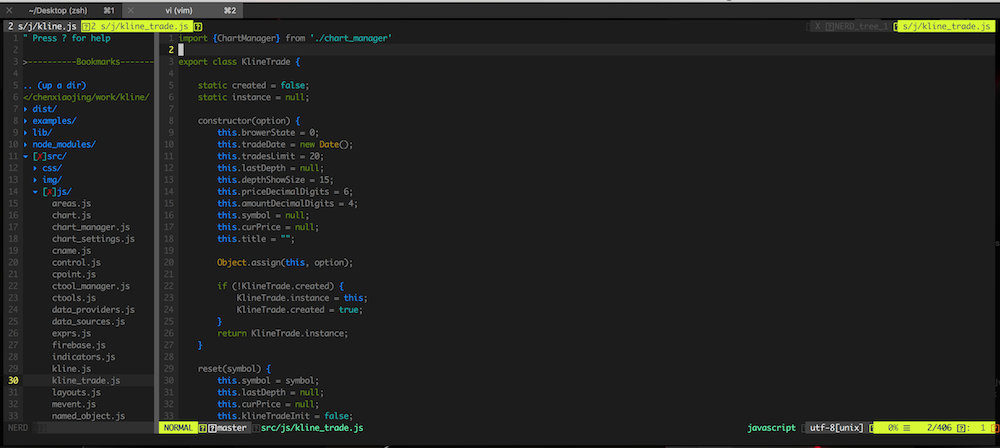
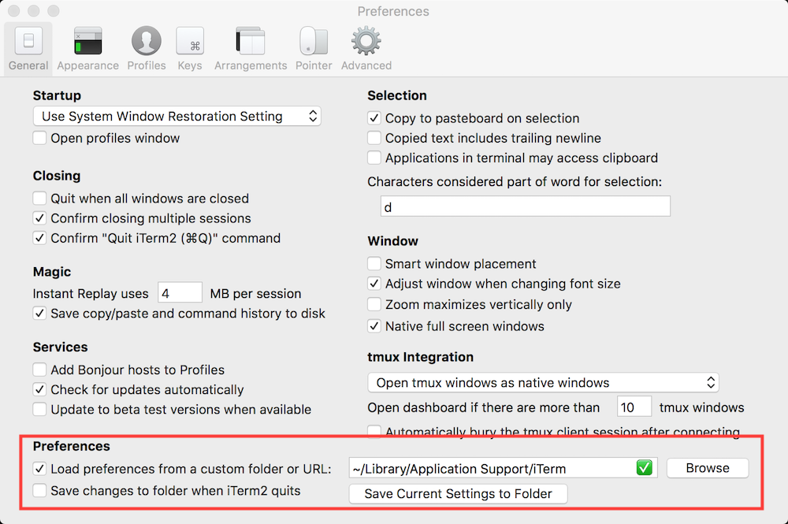

# dot-files


> My Terminal Config 工欲善其事必先利其器




# Basic

+ Install [Nerd Fonts](https://github.com/ryanoasis/nerd-fonts)
cp ./Droid\ Sans\ Mono\ for\ Powerline\ Nerd\ Font\ Complete.otf ~/Library/Fonts/

+ Effective Tools

```bash
    # http://github.com/sharkdp/bat/
    $ brew install bat

    # https://github.com/ogham/exa  
    $ brew install exa

    # https://www.npmjs.com/package/trash-cli
    $ npm install --global trash-cli

    # https://github.com/nvbn/thefuck
    $ brew install thefuck 
```


# Vim 
    


+ Install Vim
    
```bash
    $ cp .vimrc ~/
```

+ Install Vim Plugins

```bash
    $ git clone https://github.com/gmarik/Vundle.vim.git ~/.vim/bundle/Vundle.vim
    $ vim
    :PluginInstall
    $ mkdir -p ~/.vim/colors/
    $ cp ~/.vim/bundle/vim-colors-solarized/colors/solarized.vim ~/.vim/colors/        
```


# Zsh 

+ Install Zsh
    
```bash
    $ brew install zsh
```

+ Install oh-my-zsh

```bash
    $ wget https://raw.github.com/robbyrussell/oh-my-zsh/master/tools/install.sh -O - | sh
    $ chsh -s `which zsh`
    $ cp -f .zsh*  ~/
    $ source ~/.zshrc
```


# Iterm2 

+ Load config file

```bash
    $ cp com.googlecode.iterm2.plist ~/Library/Application\ Support/iTerm2/
```




+ Install [material design colors](https://github.com/MartinSeeler/iterm2-material-design)

```
 1. iTerm2 > Preferences > Profiles > Colors Tab
 2. Click Color Presets...
 3. Click Import...
 4. Select the material-design-colors.itermcolors file
 5. Select the material-design-colors from Load Presets...
```


